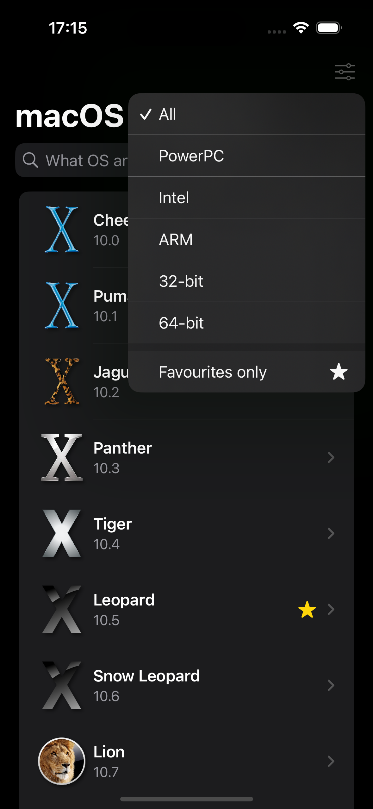
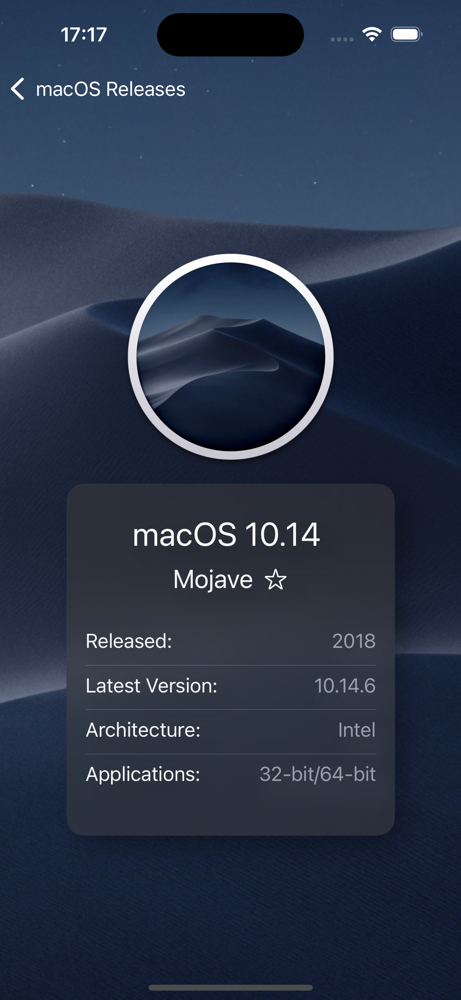
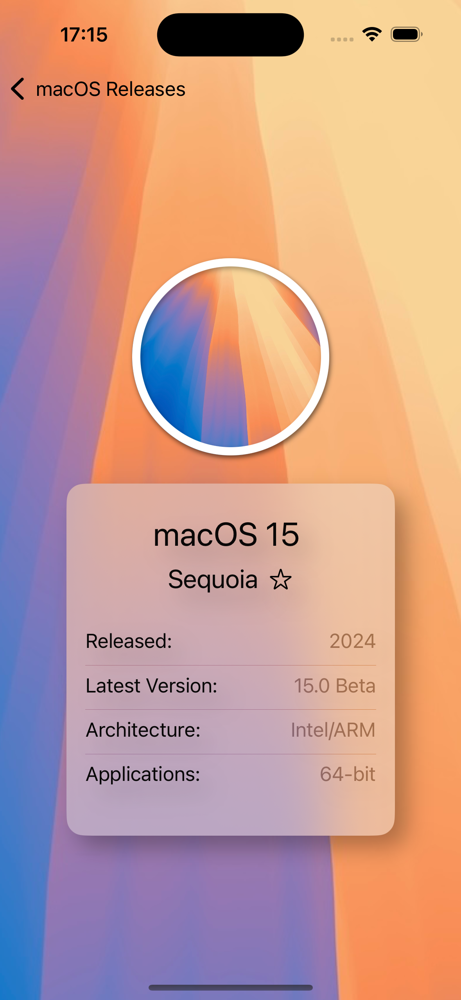

# searchOS

This app contains some information about the different releases of macOS (neé Mac OS X). It is written using SwiftUI. 

### Search

SwiftUI has a native search view modifier which is extremely easy to implement. In this app it simply filters the list. There is also a new search suggestions feature, but for this use-case filtering is a better fit.  

### Material visual effect

The material effect can be applied as a background, and will give that frosted-glass effect allowing colour in the background to bleed through to the foreground slightly. There are several opacities from .ultraThinMaterial to .ultraThickMaterial.
If foreground text is given the .secondary, .tertiary and .quaternary values, the text can now receive some of this colour bleed as well. 

### Swipe actions

Swipe actions can be easily applied to lists, using standard buttons and labels. They can be set to either leading or trailing sides, and can be coloured. Can also restrict whether a full swipe is permitted. 
I added in a swipe action to favourite an OS. There is no need for swipe to delete or any other functions for this app though. 

### Light/Dark Modes

The background images and icons will change with the system setting from Mojave onwards. The material effect will also change, along with the accent colour of the navigation. 

